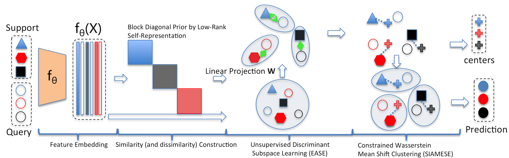

# EASE: Unsupervised Discriminant Subspace Learning for Transductive
Few-Shot Learning

This repository is the official implementation of EASE: Unsupervised Discriminant Subspace Learning for Transductive
Few-Shot Learning. This code is based on the Leveraging the Feature Distribution in Transfer-based Few-Shot Learning

## References
[Leveraging the Feature Distribution in Transfer-based Few-Shot Learning](https://arxiv.org/pdf/2006.03806.pdf)

[Charting the Right Manifold: Manifold Mixup for Few-shot Learning](https://arxiv.org/pdf/1907.12087v3.pdf)

[Manifold Mixup: Better Representations by Interpolating Hidden States](https://arxiv.org/pdf/1806.05236.pdf)

[Sinkhorn Distances: Lightspeed Computation of Optimal Transport](https://papers.nips.cc/paper/4927-sinkhorn-distances-lightspeed-computation-of-optimal-transport.pdf)

[Contrastive Laplacian Eigenmaps](https://proceedings.neurips.cc/paper/2021/file/2d1b2a5ff364606ff041650887723470-Paper.pdf)
# EASE
